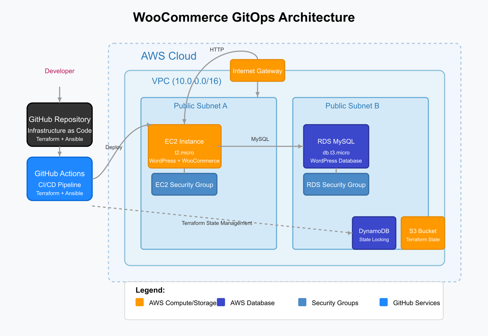

# WooCommerce GitOps Pipeline

This project automates the deployment of a WooCommerce store on AWS using Terraform, Ansible, and GitHub Actions. Designed for small to medium businesses, it provisions a cost-effective EC2 instance and RDS database, and deploys WordPress with WooCommerce. The pipeline showcases DevOps best practices, including Infrastructure as Code (IaC), GitOps, and Continuous Integration/Continuous Deployment (CI/CD).

## Architecture



The architecture includes:

- **VPC with public subnets** in multiple availability zones
- **EC2 instance (t2.micro)** running Amazon Linux 2023 for WordPress + WooCommerce
- **RDS MySQL database (db.t3.micro)** for WordPress data storage
- **Security groups** for controlled access to resources
- **S3 and DynamoDB** for Terraform state management
- **GitHub Actions** for CI/CD pipeline automation

## Project Structure

<!--  -->

The project is organized as follows:

- **`.github/workflows/`**: Contains GitHub Actions workflow definitions
  - `deploy.yml`: Main CI/CD pipeline for deploying the infrastructure and application

- **`terraform/`**: Contains Terraform configurations for AWS infrastructure
  - `main.tf`: Main infrastructure definition
  - `variables.tf`: Input variables for customization
  - `outputs.tf`: Output values after infrastructure creation
  - `provider.tf`: AWS provider configuration
  - `backend.tf`: Remote state configuration

- **`backend-setup/`**: Bootstrap Terraform backend infrastructure
  - `main.tf`: Creates S3 bucket and DynamoDB table for remote state

- **`ansible/`**: Contains Ansible configurations for application deployment
  - **`playbooks/`**: Organized Ansible playbooks
    - `deploy.yml`: Main playbook for WordPress and WooCommerce deployment
    - `backup.yml`: Backup procedures for WordPress files and database
    - `update.yml`: Update procedures for WordPress core and plugins
    - `validate.yml`: Pre-deployment validation checks
  - **`templates/`**: Jinja2 templates for configuration files
    - `wordpress.conf.j2`: Apache virtual host configuration
    - `wp-config.php.j2`: WordPress configuration template
  - **`deploy-woocommerce.sh`**: User-friendly deployment script
  - **`fix-wordpress.sh`**: Troubleshooting script for common issues

## Setup

### Prerequisites

1. AWS Account with appropriate permissions
2. GitHub repository with Actions enabled
3. Terraform (v1.1.7+)
4. Ansible (v2.9+)
5. AWS CLI configured locally

### Initial Configuration

1. **Clone the repository**
   ```bash
   git clone https://github.com/yourusername/woocommerce-gitops.git
   cd woocommerce-gitops
   ```

2. **Set up Terraform backend infrastructure**
   ```bash
   cd backend-setup
   terraform init
   terraform apply
   cd ..
   ```

3. **Create an EC2 key pair in AWS and download the `.pem` file**
   - Ensure you name it `woocommerce-key` to match the configuration
   - Store the private key securely and remember its location

4. **Configure GitHub repository secrets**
   Add the following secrets to your GitHub repository:
   - `AWS_ACCESS_KEY_ID`: Your AWS access key
   - `AWS_SECRET_ACCESS_KEY`: Your AWS secret access key
   - `SSH_PRIVATE_KEY`: Contents of your EC2 private key file (.pem)
   - `DB_NAME`: Database name for WordPress
   - `DB_USER`: Database username for WordPress
   - `DB_PASSWORD`: Secure password for WordPress database
   - `DB_HOST`: Will be automatically set by Terraform, but can be overridden

### Deployment

#### Automated Deployment with GitHub Actions

1. **Update the variables in `terraform/variables.tf` if needed**

2. **Push changes to the `main` branch**
   ```bash
   git add .
   git commit -m "Update configuration for deployment"
   git push origin main
   ```

3. **Monitor the GitHub Actions workflow**
   - Navigate to your repository's Actions tab
   - You should see the workflow running

4. **Access your WooCommerce site**
   - Once deployment completes, find the EC2 public IP in the workflow output
   - Access your site at `http://<EC2-PUBLIC-IP>/wordpress`
   - Complete the WordPress installation wizard

#### Manual Deployment

1. **Initialize and apply Terraform configuration**
   ```bash
   cd terraform
   terraform init
   terraform apply
   ```

2. **Run the Ansible deployment script**
   ```bash
   cd ../ansible
   ./deploy-woocommerce.sh
   ```

3. **Follow the script prompts to complete deployment**

## Troubleshooting

If you encounter issues with WordPress access:

1. **Run the fix script**
   ```bash
   cd ansible
   ./fix-wordpress.sh
   ```

2. **Common issues addressed by the fix script**:
   - WordPress extracted to wrong directory
   - Apache configuration issues
   - SELinux permissions
   - .htaccess configuration

## Maintenance

### Backing Up Your WooCommerce Store

```bash
cd ansible
ansible-playbook -i inventory/aws_ec2.yml playbooks/backup.yml
```

### Updating WordPress and Plugins

```bash
cd ansible
ansible-playbook -i inventory/aws_ec2.yml playbooks/update.yml
```

## Cost Analysis

- **EC2 (t2.micro)**: ~$10/month (free tier eligible)
- **RDS (db.t3.micro)**: ~$15/month (free tier eligible)
- **Data transfer**: Variable, typically $1-5/month for small stores
- **S3 & DynamoDB**: <$1/month for Terraform state storage
- **Total**: ~$20-30/month (potentially free for 12 months under AWS Free Tier)

## Security Considerations

This setup includes several security measures:
- Encrypted database connections
- Secure WordPress configuration
- AWS security groups for network isolation
- Database password stored as sensitive values
- SSH access with key-based authentication

**Production Recommendations:**
- Restrict SSH access to specific IP addresses
- Implement HTTPS with SSL/TLS certificates (now partially automated, see below)
- Set up AWS Web Application Firewall (WAF)
- Enable database encryption at rest

### SSL Certificate Management (Let's Encrypt)

This project now includes automated SSL certificate management using **Certbot** and **Let's Encrypt**.
- **How it works:** The Ansible playbook (`ansible/woocommerce-deploy/woocommerce-playbook.yml`) includes tasks to install Certbot, obtain an SSL certificate for the configured domain, and set up Apache to use HTTPS.
- **Automated Renewal:** A cron job is automatically configured to attempt renewal of the certificate periodically, ensuring your site remains secured with a valid SSL certificate.
- **Required Configuration:** To enable SSL, you must set the following environment variables before running the Ansible playbook (e.g., as GitHub secrets if using the Actions workflow, or directly if running manually):
    - `DOMAIN_NAME`: Your fully qualified domain name (e.g., `store.example.com`). This domain must resolve to the EC2 instance's public IP address.
    - `CERTBOT_EMAIL`: Your email address, used by Let's Encrypt for registration and important notifications.

## Monitoring and Logging

To enhance observability and troubleshooting, the following features have been implemented:

- **Centralized Logging:**
    - Apache access and error logs, as well as WordPress debug logs (if `WP_DEBUG` is enabled), are configured to be forwarded to a remote syslog server.
    - This is managed by `rsyslog` on the EC2 instance.
    - **Required Configuration:** You need to set the `REMOTE_SYSLOG_SERVER` environment variable to the address of your syslog server (e.g., `logs.yourdomain.com`). The Ansible playbook (`ansible/woocommerce-deploy/woocommerce-playbook.yml`) uses this variable to configure `rsyslog`.
    - WordPress debug logging is now configured in `wp-config.php` to write to `/var/log/wordpress/debug.log`, which is then picked up by `rsyslog`.

- **Health Check Endpoint:**
    - A basic health check endpoint is available at `/wordpress/health-check.php`.
    - This script checks the WordPress database connection.
    - **Success:** Returns HTTP 200 with the message "WordPress OK".
    - **Failure:** Returns HTTP 503 with "WordPress DB connection error".
    - This can be used by monitoring services to quickly assess the basic health of the WordPress application.

## Automated Testing

The Ansible playbook for WooCommerce deployment can be tested locally using a Docker-based environment. This helps ensure the playbook's reliability and catch issues early.

- **Location:** Test scripts and Dockerfile are located in the `tests/playbook_test/` directory.
- **Functionality:** The test environment builds a Docker image based on `rockylinux:8`, installs Ansible and necessary services (Apache, MariaDB, PHP), and then runs the `woocommerce-playbook.yml` against a local MariaDB instance within the container. It verifies that the playbook completes successfully, Apache is running, and the WordPress health check endpoint is operational.
- **Instructions:** For detailed instructions on how to build the Docker image and run the tests, please refer to the `README.md` file within the test directory: [`tests/playbook_test/README.md`](tests/playbook_test/README.md).

## Future Improvements

- Multi-availability zone deployment for high availability
- CloudFront integration for content delivery
- Automated database backups to S3
- Monitoring and alerting with CloudWatch
- Auto Scaling for handling traffic spikes

## License

This project is licensed under the MIT License - see the [LICENSE](LICENSE) file for details.

## Acknowledgments

- WordPress and WooCommerce communities
- Terraform and Ansible documentation
- AWS Architecture Center

## Lessons Learned

- Optimized Ansible playbook for idempotency, ensuring reliable deployments
- Implemented GitOps workflow for version-controlled infrastructure
- Balanced cost optimization with performance for small business use cases